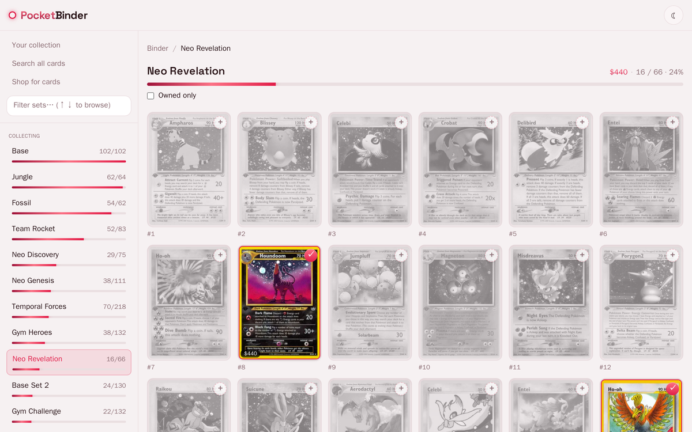
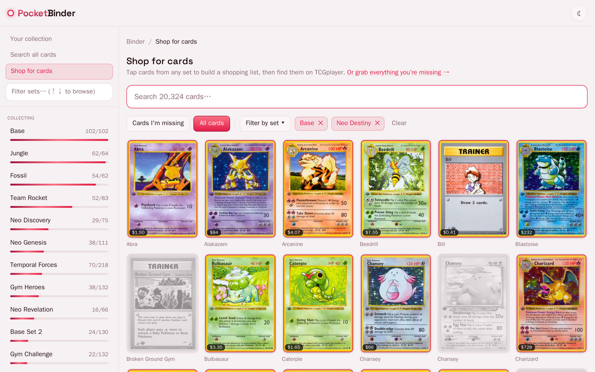
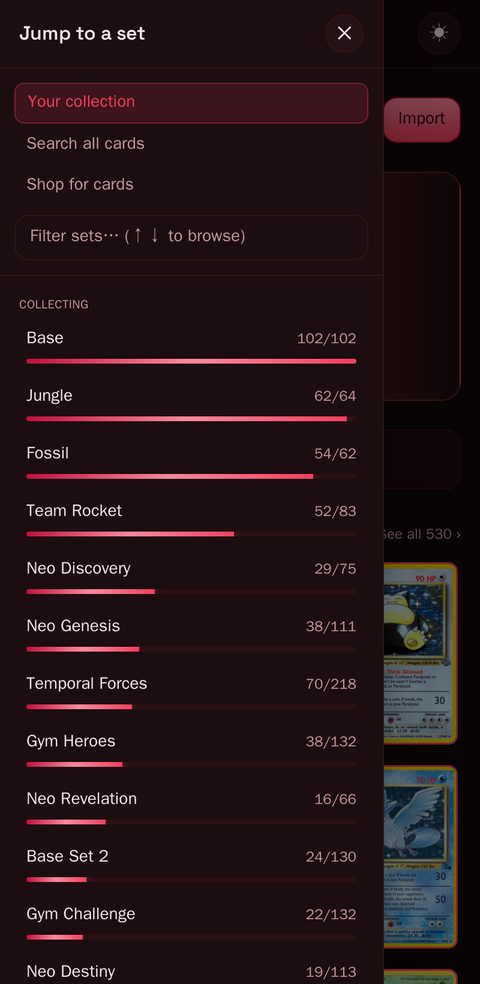

# PocketBinder

[](https://github.com/BenGNelson/pocketbinder/actions/workflows/ci.yml)

A self-hosted **Pokémon TCG collection tracker**. Browse every set from a local
catalog, tap the cards you own to light them up, watch your collection's market
value, and build a TCGplayer shopping list for the cards you're still missing.

_AI-assisted build._


---

## What it does

- **Browse every set** — the whole English catalog (~170 sets / ~20k cards),
  ingested from the public [`pokemon-tcg-data`](https://github.com/PokemonTCG/pokemon-tcg-data)
  dataset into a local SQLite database. A persistent set sidebar (an off-canvas
  drawer on mobile) — with a filter and keyboard ↑/↓ navigation — keeps every set
  one click away, each with a completion bar, so cards stay the focus of the page.
- **Collect by tapping** — open a set and the cards you don't own are dimmed and
  gray. Tap a card's corner badge and it flips to full color with a little
  holographic shine, then settles back into place. Press-and-**hold** a gray card
  to peek its full-color art without collecting it. No spreadsheet, no account, no
  data entry that feels like data entry.
- **Show it off** — a foil stats hero (cards owned · sets complete · sets in
  progress · % of catalog, your binder's market value alongside) leads a wall of
  the cards you own; the gaps read at a glance. Sort the wall by value, name,
  recently-added, or set, and **star** the standouts to pin them up top.
- **Market value** — with a free [pokemontcg.io](https://dev.pokemontcg.io) API
  key, the app refreshes TCGplayer/Cardmarket prices for the cards you own
  (daily, owned-only, so it stays ≤1 day fresh) and totals your collection value.
  Prices ride along as a chip on each card and as a per-set owned-value.
- **Shop for what you're missing** — a dedicated **Shop** page to hand-pick cards
  across any sets (defaulting to the ones you don't own, filterable by set) into a
  shopping list, then copy it into **TCGplayer Mass Entry**. TCGplayer's own cart
  optimizer finds the fewest sellers to minimize shipping. PocketBinder builds the
  list; TCGplayer matches the sellers — no scraping.
- **Bulk import** — already have your collection in a spreadsheet or an export
  from another tool? Import a CSV/JSON once (see [Filling your collection](#filling-your-collection)).
  A re-import refreshes the imported cards but preserves your in-app edits.

Mobile-first, with light and dark themes (a header toggle; light by default).

## Screens

| Collect a set | Shop for the gaps |
|---|---|
| [](docs/set.jpg) | [](docs/shop.jpg) |
| Owned cards in color, the gaps grayed — tap to collect. Completion and owned value up top. | Hand-pick cards across any sets, then copy them into a TCGplayer Mass Entry list. |

<p align="center">
  <br>
  <sub>Mobile-first, with light + dark themes — on phones the set sidebar becomes an off-canvas drawer.</sub>
</p>

## Quick start

```bash
git clone https://github.com/BenGNelson/pocketbinder && cd pocketbinder
cp .env.example .env

# (recommended) pull the full catalog — otherwise a tiny 2-set example is used:
bash scripts/bootstrap-catalog.sh          # clones pokemon-tcg-data into ./data
#   → then set CARD_DATA_SRC in .env to the path it prints

docker compose up --build -d               # backend + frontend
# open http://localhost:8088
```

The catalog indexes itself on first boot (a minute or so for the full dataset —
the hub shows a "building the catalog…" state until it's ready). Card images are
fetched from the public CDN and cached on demand — no bulk download. For market
value, add a free `POKEMONTCG_API_KEY` to `.env` and restart the backend.

> **Note:** Docker publishes the ports on all interfaces, so anyone on your LAN
> can reach the app. It has **no authentication** — it's built for a trusted home
> network. Don't expose it directly to the internet.

## Filling your collection

**The main way is just to tap.** Open a set and tap the badge on each card you
own — that's the intended flow, and the reveal animation makes ticking through a
set genuinely quick. Everything you tap is saved instantly.

**Bulk import (optional).** If you already have your collection in a file, use
**Import** on the hub. There's an in-app "Import a whole collection from a file"
helper with the format and a downloadable sample; the short version:

- One row per card. A **CSV** with a header row, or a **JSON** list of objects.
- Required columns: `setid,number`. Optional: `variant,qty,condition,wishlist,notes`.
- `setid` may be the **set code** you know (`BS`, `SSH`) **or** the dataset id
  (`base1`, `swsh1`). `number` is the card's collector number.

```csv
setid,number,variant,qty
BS,4,holofoil,1
base1,58,,2
swsh1,1,,1
```

See [`sample-collection.csv`](sample-collection.csv). Cards with no catalog match
are reported back to you, never silently dropped. A re-import replaces the
imported rows but keeps anything you've edited in the app.

> Importing from another site's account (scraping a logged-in page, pasting a
> session cookie) is intentionally **not** part of PocketBinder — it's fragile and
> a security risk. Bring your data in as a file instead.

## How it works

- **Backend** — FastAPI + stdlib SQLite (no ORM), running as a non-root user. A
  background thread ingests the `pokemon-tcg-data` clone into `card_sets`/`cards`
  (mtime-skip, prune-on-clean-pass) and — when an API key is set — refreshes
  prices for owned cards only. The DB runs in WAL mode so the indexer and
  requests don't block each other. Card faces are proxied from
  `images.pokemontcg.io` and cached as downscaled WebP on first view (the backend
  never redistributes images).
- **Frontend** — React + Vite + Tailwind, built to static and served by nginx,
  which reverse-proxies `/api` so the whole app is one origin. A master-detail
  shell (a persistent set sidebar beside the card content, an off-canvas drawer on
  mobile) keeps cards the focus. Cards seat into binder pockets; owning one plays a
  foil "reveal". Theming is token-driven (light default + a dark toggle). Ownership
  edits are optimistic (instant, with a rollback if the write fails); view state
  that isn't the collection — theme, collection sort, the in-progress shopping list
  — lives in the browser via a tiny `localStorage` store. Card faces load
  same-origin through the proxy; a strict CSP blocks external hosts (the one inline
  theme script is allowed by a sha256 hash).
- **Data model** — completion, owned counts, and value are pure SQL joins over a
  single `card_ownership` table. Rows carry a `source` (`imported` vs `manual`
  edit) so a re-import never clobbers your in-app changes.

## Configuration

All configuration is environment variables in `.env` (copied from
`.env.example`, which documents each one). The essentials:

| Variable | Default | Purpose |
|---|---|---|
| `CARD_DATA_SRC` | the bundled 2-set example | Host path to your `pokemon-tcg-data` clone (mounted read-only) |
| `POKEMONTCG_API_KEY` | _unset_ | Free key from dev.pokemontcg.io; enables owned-card market prices |
| `FRONTEND_PORT` / `API_PORT` | `8088` / `8010` | Host ports |

## Data, updates & backups

- **Where your data lives:** the Docker named volume **`pocketbinder-data`** (the
  SQLite DB with the catalog + your collection, and the WebP image cache). Your
  collection survives image rebuilds.
- **Update the app:** `git pull && docker compose up --build -d`.
- **Refresh the catalog** (new sets): re-run `bash scripts/bootstrap-catalog.sh`,
  then `docker compose up -d backend`.
- **Back up your collection:** back up the `pocketbinder-data` volume, e.g.
  `docker run --rm -v pocketbinder_pocketbinder-data:/d -v "$PWD":/out alpine \
  tar czf /out/pocketbinder-backup.tar.gz -C /d .`

## Development & tests

Hot-reload dev server (opt-in): `docker compose --profile dev up frontend-dev`
(http://localhost:5175). Run the test suites (throwaway containers, no host
toolchain needed):

```bash
bash scripts/test.sh          # backend pytest + frontend vitest
```

The same suites run in CI on every push and pull request (see the badge above).

**Contributing?** Enable the privacy-guard pre-commit hook once per clone — it
blocks a commit whose staged changes contain a host identifier (hostname, LAN/VPN
IP, absolute home path) so nothing environment-specific lands in this public repo:

```bash
git config core.hooksPath scripts/git-hooks
```

## Roadmap

- **Importers for other tools** — adapters that read exported files (CSV) from
  popular collection apps into PocketBinder's format. File-based, so no
  credentials and nothing to scrape.
- **Optional access control** — a simple token for people who want to reach it
  beyond a trusted LAN.

## Disclaimer

Not affiliated with, endorsed by, or sponsored by Nintendo / Game Freak /
Creatures / The Pokémon Company. "Pokémon" and card names/images are trademarks
and copyrights of their respective owners. This is a non-commercial fan tool.
Card metadata is from the public `pokemon-tcg-data` project. The app fetches card
images at runtime and does **not** bundle or redistribute the image dataset; the
screenshots in this README show card art for illustration only.

## License

[MIT](LICENSE).
